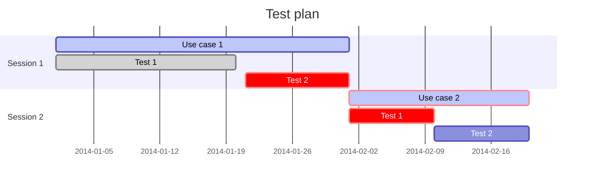
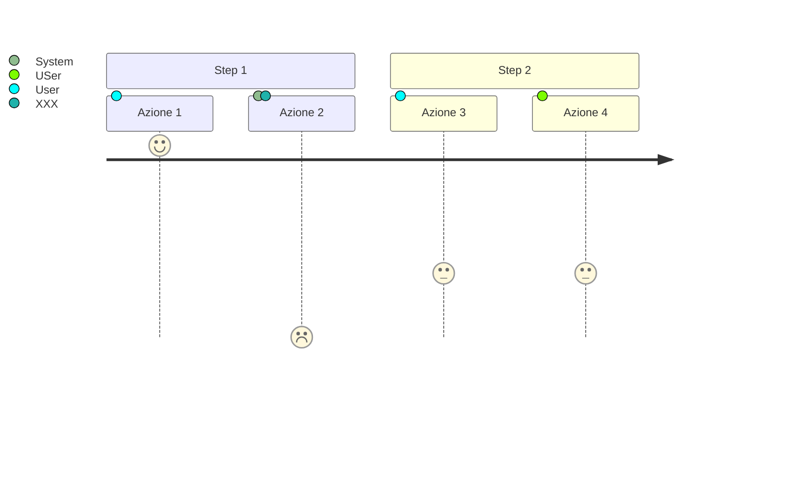

# Testbook di esempio (inserisci il nome del progetto al posto di questo titolo)

## Use case 1

**Status: TODO, WORKING, PASSED, FAILED, BLOCKED**

<!-- ### Descrizione -->

Qui descriviamo l'oggetto del test, a grandi linee, ad es: *L'utente inserisce i suoi dati e arriva correttamente alla pagine finale.*

### Plan

Pianificazione dei test:

- 2022-02-02 10:30-12:00 - SIT
  - note, es: elenco stakeholder da coinvolgere
- 2022-02-03 10:30-12:00 - UAT

> eventuale gantt, se utile

### Step

- Azione 1: organizza le azioni come è più comodo, aggiungi descrizioni, commenti, tag, note...
- Azione 2: when ... then ...
- Azione 3
- Azione 4

> Volendo puoi aggiungere un grafico esplicativo:

### Requisiti - Data preparation

Descrivi cosa serve per preparare il test:

- utenza salvata sul DB
- documenti dell'utente
- presenza di XXX...

### Log

#### 2022-02-01
- Fallito step 2 - indagare problema di XXX...
- [Link a jira, email, documento sharepoint o altro]()

### To do

Se necessario, puoi mantenere una lista di todo per questo test.

- to do 1
- to do 2

### Links

Eventuali link a test automatici
