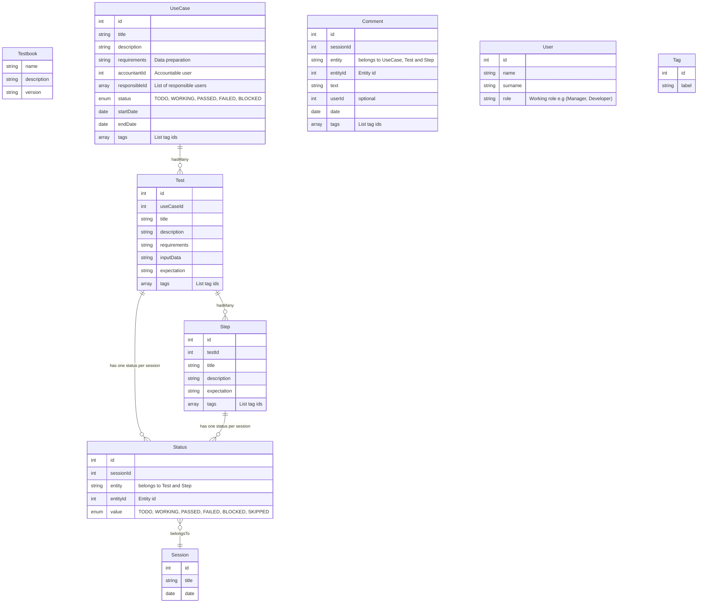

# Data model

Relational schema of the data model, with some exceptions (`tags` and `responsibles`, which are not normalized).

We want data to be explored by many points of view, such as:

- navigate trhrough use cases to test and steps
- view what test and steps have been executed per session, and what was their status
- report test statuses (ideally in a graph)
- view comments per session, data or test

