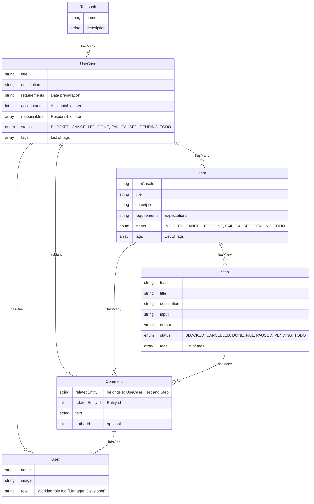

# Technical analysis

## General ER schema



## Data model

App uses PouchDB as database, so data is modeled upon it's caracteristichs.

App also relies on PouchDB capability to observe changes to manage it's state in a reactive way.

---

### Testbook

A testbook represents a project and contains `use cases`, `tests` and `steps`. A testbook is an independent entity and can be added or removed without affecting other testbooks. It can also be imported/exported as json file (nice to have).

Then, testbook is represented as a [PuochDB database](https://pouchdb.com/api.html#create_database).

#### Testbook model

Testbook is a PouchDB database and contains document related to other entities (use cases, tests, steps and comments)

Functional data model of a testbook is a tree:

- Testbook
  - Use case
    - Test
      - Step

Use case, Test and Step have a "status" property, that can be one of:

- BLOCKED
- CANCELLED
- DONE
- FAIL
- PAUSED
- PENDING
- TODO

Use case, Test and Step can be associated to many:

- tags
- comments

Use cases are also associated to `user`.

In each testbook database, there is also another document of "type" "INFO", that is a singleton (PouchDB `_id` is set to `db_info`) and contains testbook description and metadata.

Testbook "db_info" structure is:

```ts
// /src/types/testbook.ts

type TestbookInfo = {
  _id: string;
  slug: string;
  name: string;
  description?: string;
  created: string;
} & Record<TestbookAdditionalInfo, string>;

type TestbookAdditionalInfo = "client" | "created" | "description";
```

#### Testbook index

In addition, there is a global database called `index_db__` that contains an index of all testbooks installed in an app instance. It's used in the `/` page to list saved testbooks.

---

### Use case

A use case is a test container, it represents an application requirement to be verified.

> Example: Verify user login

#### Use case model

In database, it's represented ad a [document](https://pouchdb.com/api.html#create_document) with `type` property set to **USE_CASE**

> Entity types are described in `/src/types/entityTypes.ts`

```ts
// /src/types/useCase.ts

export type UseCase = {
  type: TYPE.USE_CASE;
  slug: string;
  title?: string;
  description?: string;
  requirements?: string;
  accountantId?: string; // foreign key to User
  responsibleId?: string; // foreign key to User
  status: STATUS;
  startDate?: string;
  endDate?: string;
  tags: string[];
  created?: string;
  modified?: string;
} & PouchDB.Core.IdMeta;
```

> `accountantID` and `responsibleId` are related to `users`.

### Test

Tests are expectations we want to control for each use case. Test describes desired output of a use case, given some input, so for each use case it's required to test it in different conditions: these are tests.

> Example:
>
> - Testing valid credentials: user can login soccesfully
> - Testing incalid credentials: user get an error
> - User can sign up
> - User can recover password

#### Test model

In database, it's represented ad a [document](https://pouchdb.com/api.html#create_document) with `type` property set to **TEST** and has a key to reference to it's parent "use case".

> Entity types are described in `/src/types/entityTypes.ts`

```ts
// /src/types/test.ts

type Test {
  type: TYPE.TEST,
  slug: string,
  useCaseId: string,
  title?: string,
  description?: string,
  requirements?: string,
  status: STATUS,
  startDate?: string,
  endDate?: string,
  tags: string[],
  created?: string,
  modified?: string
} & PouchDB.Core.IdMeta;
```

### Test properties

### Step

Every test requires a set of actions to verify expectations, these are called `steps`. Every step is the exact statement user has to do in order to verify the test.

Steps are collected in fixed order, executing a test means to follow all steps in the right order.

> Example of a list of steps, related to previous test "Testing valid credentials":
>
> - Go to /login
> - Set user: "John"
> - Set password to "valid-pwd"
> - Click login button
> - Check to be redirected to page "/private"

**Steps need to be single entities because it's crucial to log what steps is ok and what fails.**

#### Step model

In database, it's represented ad a [document](https://pouchdb.com/api.html#create_document) with `type` property set to **STEP**

> Entity types are described in `/src/types/entityTypes.ts`

```ts
// /src/types/step.ts

type Step {
  type: TYPE.TEST,
  slug: string,
  testId: string,
  title?: string,
  description?: string,
  input?: string,
  output?: string,
  status: STATUS,
  startDate?: string,
  endDate?: string,
  tags: string[],
  created?: string,
  modified?: string
} & PouchDB.Core.IdMeta;
```

### Secondary data

#### Comment

Comment are **polymorphic** entities, so they can be associated to many models. In the database it's represented as a couple of keys: `relatedEntity` and `relatedId`.

It also belongs to "User", named "author" here.

```ts
// /src/types/comment.ts

type Comment {
  type: TYPE.COMMENT,
  relatedEntity: string, // can be any TYPE in ./entityTypes
  relatedId: string, // foreignKey
  text: string,
  authorId?: string, // related to User
  solved: boolean,
  created?: string,
  modified?: string
} & PouchDB.Core.IdMeta;
```

#### User

User entities are shown as external entities in `use cases` as `accountantId` and `responsibleId`, and in `comments` as `authorId`.

```ts
// /src/types/user.ts

type User {
  type: TYPE.USER,
  name: string;
  image?: string,
  role?: string,
  created?: string,
  modified?: string
} & PouchDB.Core.IdMeta;
```
